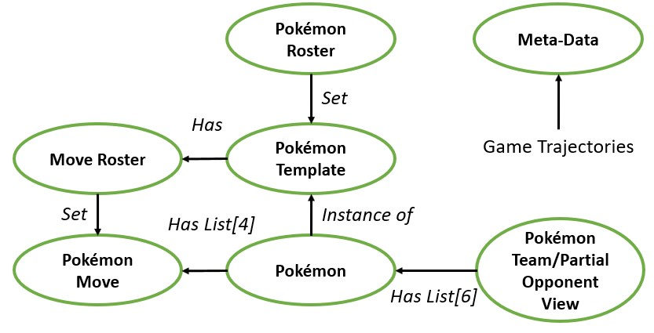
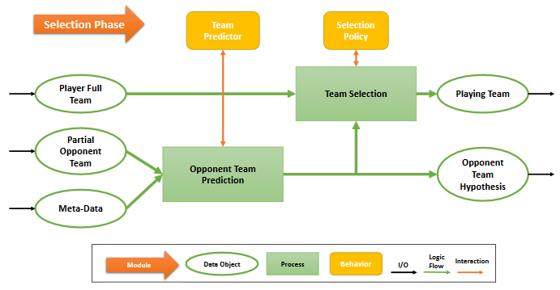
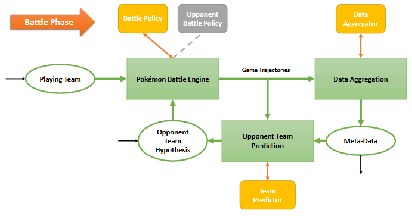
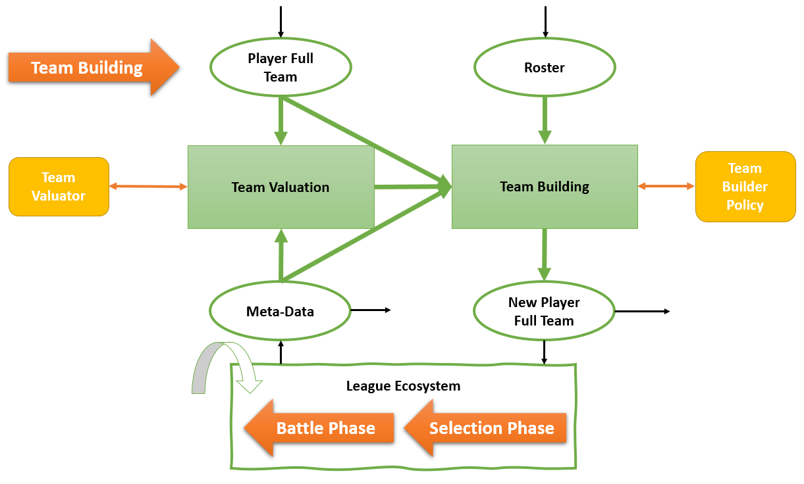
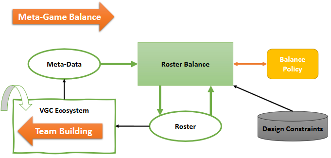

# Pokémon VGC AI Framework

(Legacy repository: https://gitlab.com/DracoStriker/simplified-pokemon-environment)

## Introduction

Meta Game Balance is a challenging task for human designers, they must perform exhaustive 
testing and analysis of compositions over a vast array of variables which don't relate in 
a trivial fashion. AI agents could assist developers by play testing and proposing game 
fixes. Contrarily to humans, is difficult to train AI agents to value units, 
composition of units and predict new scenarios with expansion of unit rosters. Balance 
requires deep understanding of the game mechanics, as knowing how to play requires good 
valuation of units and compositions, which are affected by game balance fixes.

Pokémon competitions fit perfectly in the previous scenario. In Pokémon Video Game 
Championships (VGC) players compete over a succession of battles after selecting team 
with only partial information about their opponent's options. Furthermore, a limited
but extensive roster of Pokémon are available, and players must commit to their 
selection of units which they will be using for rest of the competition. Players are 
allowed  to personalize the attributes of their units to some extent, such as their 
attacks and abilities, in addition many abilities are hard to value when decontextualized
because they are dependent on the opponent team and meta-game. As such, to allow deep 
player strategies in VGCs, Pokémon game designers must correctly balance the roster.

The Pokémon VGC AI competition is a new model of AI competition where AI agents must 
learn how to perform meta-game balance. A framework over the Pokémon battling domain 
was developed, which allows run an ecosystem that simulates an interdependent multi-task 
model, since we are present with a challenge that requires sequential different types of 
decisions which are recursively interdependent. It is based on the method used by 
competitive human players on VGCs who try to win by  predicting the meta-game. We hope to
bridge new collaboration between game industry practitioners and Game AI researchers and 
gain new insights on this domain of knowledge.

## Framework Summary

The VGC Framework has double purpose. The first is run AI competitions, where contestants
submit their software agent solutions. The second is to allow players to design and train
their models in the same environment where the competition itself is run.

### Data Model



A Pokémon Template defines the possible moves a Pokémon may have, what are the range of 
values their attributes can have, an so on. A Pokémon is an instance of a template and has
concrete moves and attributes configured. A Pokémon Team is composed of six different 
Pokémon. The Move Roster defines which moves are legal in a VGC AI competition, and the 
Pokémon Roster defines which Pokémon Templates are legal for tournament use. Meta-Data 
contains analytics about the history of battles and team/individual Pokémon usage.

### Selection Phase



Given the player team, a partial view of the opponent team and meta-game data the aim is 
to choose the most optimal sub-team selection. This is done in two steps. First using 
meta-data and the partial view of the opponent team we hypothesize the opponent units. 
After this preprocessing, we choose the best team that best suits against the opponent.

### Battle Phase



Each player observes the current game state and choose their action for this turn. Turns 
snapshots are stores in the form of trajectories that used both to update knowledge we 
have about the opponent's team and update the ecosystem’s meta-game. We loop until the
battle finishes.

### Team Build Phase



Between battles each player is given the opportunity to analyse the meta-game and
restructure their team. First team performance is evaluated giving their current team 
and meta-data. The current team value together with the available roster is used to adapt 
the team if needed. When ready the player can engage against in the competition ecosystem, 
where is paired against other players to battle. This process can be repeated until the
player finds a satisfying team, within time constraints, as it can choose not to engage 
in any battle and re-evaluate immediately its newer team.

### Meta-Game Balance Phase



By running a full VGC Ecosystem of players building teams and battling, the Meta-Game 
data is updated over time. Using that information, and restricted to some design 
constraints, a balance agent can make changes to the Roster in an online fashion.

## Application Programming Interface

The VGC AI API was designed so a view from the game state is provided to agents, without 
enabling the same to manipulate the game state.

### Game State/Pokémon Roster View API

A Pokémon Battle Game State is composed by two opposing teams, where the self team is the 
idx=0, the opponent is idx=1, and composed by a global weather condition.

```python
class GameStateView:
    def get_team_view(idx: int) -> PkmTeamView
    def weather_condition -> WeatherCondition
    def n_turns_no_clear -> int
```

A Pokémon Team stores the active Pokémon and party Pokémons. Also stores the active 
Pokémon exclusive battle stats:
* Stage level of every stat increase or decrease of the active Pokémon.
* Flag indicating if the active Pokémon of this team is confused.
* How many turns the active Pokémon of this team is confused.
* Flags indicating if there are entry hazard conditions on this team's side of the field.

```python
class PkmTeamView:
    def active_pkm_view -> PkmView
    def get_party_pkm_view(idx: int) -> PkmView
    def get_stage(stat: PkmStat) -> int
    def confused -> bool
    def n_turns_confused -> int
    def get_entry_hazard(hazard: PkmEntryHazard) -> int
```

A Pokémon stores its move set, type, hit points, status (SLEEP, PARALYZED...) and
how many turns has been asleep.

```python
class PkmView:
    def get_move_view(idx: int) -> MoveView
    def type -> PkmType
    def hp -> float
    def status -> PkmStatus
    def n_turns_asleep -> int
```

A Pokémon Move is composed by a vast array of attributes, its type, accuracy, 
power points, power, and many effect attributes:
* Flag indicating if the move has priority.
* The probability of the move effects.
* Flag indicating if the move recovers hit points.
* How much fixed damage the move deals.
* What status the move inflicts.
* What stats it changes its stats.
* How many stages the move increases or decreases.
* What weather the move sets.
* Who is the target of the move effect (self or opponent).

```python
class MoveView:
    def power -> float
    def acc -> float
    def pp -> int
    def type -> PkmType
    def priority -> int
    def prob -> float
    def target -> int
    def recover -> float
    def status -> PkmStatus
    def stat -> PkmStat
    def stage -> int
    def fixed_damage -> float
    def weather -> WeatherCondition
    def hazard -> PkmEntryHazard
```

For team building the legal Pokémon roster can be accessed. A Pokémon roster is a
set of Pokémon templates that define which specimens are legal do build. A Pokémon
template is constituted by the Pokémon move roster. The VGC AI framework will validate
and output team and accept or reject.

```python
class PkmRosterView:
    def get_pkm_template_view(idx: int) -> PkmTemplateView
    def n_pkms -> int

class PkmTemplateView:
    def get_move_roster_view(idx: int) -> MoveRosterView
    def pkm_type -> PkmType
    def max_hp -> float
    def get_copy() -> PkmTemplate

class MoveRosterView:
    def get_move_view(idx: int) -> MoveView
    def n_moves -> int
```

### Competitor API

A competitor must implement the desired behaviours to compete. The engine will fetch agent
implementation asa plugin by detecting modules that follow the competitor API. It depends
on the role of Player or Balance agent, they only needs certain implemented modules. 
Agents may receive a view object of the game state or a game state encoding.

```python
class Behaviour(ABC):
    def get_action(s) -> Any
    def requires_encode() -> bool
    def close()

class BattlePolicy(Behaviour):
    def get_action(s) -> int

class SelectorPolicy(Behaviour):
    def get_action(s) -> Set[int]

class TeamBuilderPolicy(Behaviour):
    def get_action(s) -> PkmFullTeam

class TeamPredictor(Behaviour):
    def get_action(s) -> PkmTeamPrediction

class DataAggregator(Behaviour):
    def get_action(s) -> MetaData

class TeamValuator(Behaviour):
    def get_action(s) -> TeamValue:

class BalancePolicy(Behaviour):
    def get_action(s) -> PkmRoster

class Competitor:
    def battle_policy -> BattlePolicy
    def selector_policy -> SelectorPolicy
    def team_builder_policy -> TeamBuilderPolicy
    def team_hyphotesizer_policy -> TeamPredictor
    def data_aggregator_policy -> DataAggregator
    def team_valautor_policy -> TeamValuator
    def balance_policy -> BalancePolicy
    def team -> PkmFullTeam
    def meta_data -> MetaData
    def want_to_change_team -> bool
```

## Competition Tracks and Rules

Each proposed track tackle different complexity problems on the VGC Competition. An entrant must 
submit a Competitor module which implements one or more of the defined above behaviours.

The three main tracks are bellow. Any contestant may register for one or more tracks.

1. The Battle Track agents only compete with battle policies.
2. The VGC Track, competitors must master the skills of battling, team selection and team building.
3. The Balance track, the competitor must generate and manage the best roster.

In the Battle Track, the winner is determined by the outcome of isolated sequential battles. Teams
are randomly generated at each round for each match. The matches are schedule as binary tree. To 
assert fairness generated teams are interchanged between a match so both player can compete under 
the same conditions. The Competitor agent is required only to implement a BattlePolicy.

In this track, agents must be able to compete in a full VGC, where they must build their teams, 
do meta game analysis and battle. A fixed roster is generated at the beginning of the competition. 
It must implement all behaviours with exception a BalancePolicy. Each participant must also define 
their concrete implementation of the MetaData and TeamValue. MetaData are analytics about the 
current state of the Meta Game. TeamValue is an n-dimensional evaluation given to a team, which can 
be used to compare different generated teams. There is a first preparation phase, where agents can
engage battle as many times as they want and may adapt regularly their team. Agents are paired with 
opponents in epochs where they are only able to fight, after which players enter a new epoch with
the opportunity to use new teams. By the end, there is the final tournament where agents compete 
in a tree like tournament like in the Battle Track. Competitor agents may only choose one of the
teams they used in the preliminary stage. The aim is to incentive agents to perform well during 
the preparation phase and contribute to enrich the meta-game data. The team selected is the one
where the TeamValuator behavior of the agent give the greatest evaluation.

In this track a competitor enters with a balance agent constituted by a balance policy, TeamValuator
and DataAggregator behaviors. Each competitor is assigned to design the roster for a full 
VGC Ecosystem. The roster closer to the design constraints and aims wins the competition. Each
competitor is given the same number of epochs, and points are accumulated by the end of each epoch.

### Specifications

* There are 18 types.
* In battle teams are composed of three members.
* Full teams are composed of four members for the VGC and Balance tracks.
* Roster size is 151 for the VGC track.
* For deep solutions we have encoding of size:
  * MOVE_ENCODE_LEN = 42
  * PKM_ENCODE_LEN = 195
  * TEAM_ENCODE_LEN = 591
  * GAME_STATE_ENCODE_LEN = 1188

The PkmBattleEnv complies to the OpenAI Gym standard. In the observation field is returned the game
state encoding for each player. In the info field is returned the game state view for each player.
The returned reward is equal to the damage given and taken differential, with an extra bonus
if an opponent Pokémon was knocked out and another extra bonus if the players wins the battle.
Terminal field is true when the battle ends.

## TODO

* Design Restriction Constraints Language

## Contact us

For any information or issue report, contact the organization team.

Organization team:

* Simão Reis (simao.reis@outlook.pt)
